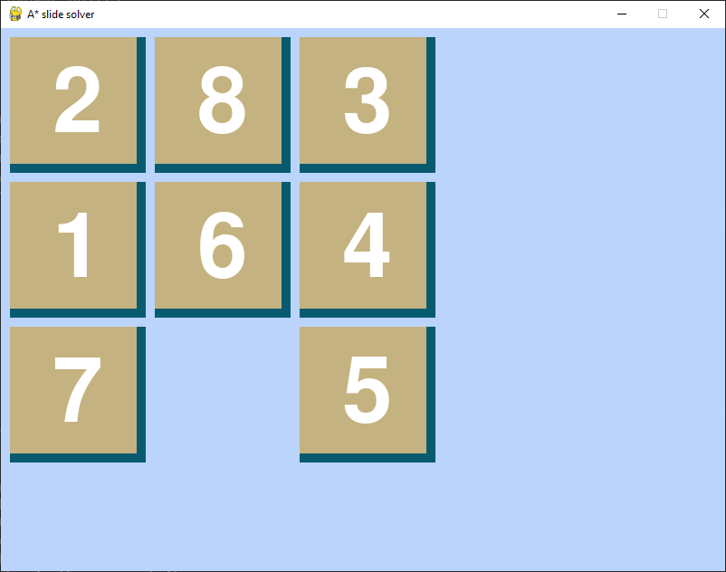

# What is the game ?

The famous **8-puzzle** game,which is a sliding puzzle that consists of a frame of numbered square tiles in random order with one tile missing.

# Why the A* algorithm ?

# Screenshots of the game

